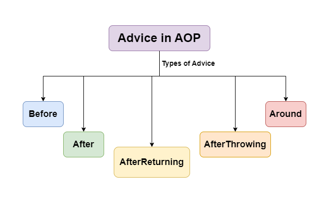

# Spring AOP

# AOP Concept 
### [AOP Concept Link](https://docs.spring.io/spring-framework/reference/core/aop/introduction-defn.html)


# Understanding AOP Concepts

### Aspect :
```markdown
 The key unit of modularity in AOP, representing a concern that cuts across multiple classes. For example, an aspect for logging can be applied across various methods in different classes.
 ```
### Advice : 
```
This is the action taken by an aspect at a particular join point. There are five types of advice:
```

### Before :
```
Executed before the method call.
After : Executed after the method call, regardless of its outcome.
```

### AfterReturning : 
```markdown
Executed after the method returns a result, but not if an exception occurs.
Around : Surrounds the method execution, allowing you to control the method execution and its result.
AfterThrowing : Executed if the method throws an exception.
```
Advice in AOP


### Join Point :
```
 A specific point in the execution of a program, such as method execution or exception handling, where an aspect can be applied.
```

# Pointcut : 
```
A predicate that matches join points. A pointcut expression specifies where an advice should be applied.
```
# Weaving : 
```
The process of linking aspects with the target object. Weaving can occur at compile-time, load-time, or runtime. Spring AOP performs runtime weaving using proxy-based mechanisms.
```

# Dominant AOP Frameworks

```
AspectJ : A powerful and mature AOP framework that supports compile-time and load-time weaving. It offers full AOP support with its own syntax and tools.

JBoss AOP : Part of the JBoss application server, offering integration with Java EE applications.

Spring AOP : A simpler, proxy-based framework that integrates with the Spring Framework, using XML configurations or annotations to define aspects and pointcuts.

```

# 1. Logging the Calls


#### 2.Before Advice 

- `Aspect` - LoggingAspect
- `Advice` - @Before 


```java


import org.slf4j.Logger;

import org.slf4j.LoggerFactory;

public class LoggingAspect {
    
    // if any  method is called maintain the logs 

    private static final Logger LOGGER = LoggerFactory.getLogger(LoggingAspect.class);


// Before  Returning 

// return type first , then class name full path, args  
    // @Before("execution(* *.*(..))")   // all the return type , all the class * and .* all the methods , (..) args 
    @Before("execution(* com.jspring6.springbootrestaop.service.JobService.*(..))")
    public void logMethodCall()
    {
        LOGGER.info("Method Called");
    }
}
```

#### 2. Joint Point 

- If you want to target a particular method and want to hold on it it is called thr Join Point 

```java

 @Before("execution(* com.jspring6.springbootrestaop.service.JobService.getJob(..)) || execution(* com.jspring6.springbootrestaop.service.JobService.load(..))")
    public void logMethodCall(JoinPoint jp)
    {
        LOGGER.info("Method Called "+ jp.getSignature().getName());
    }

```

### 3. After Advice 

```java


```